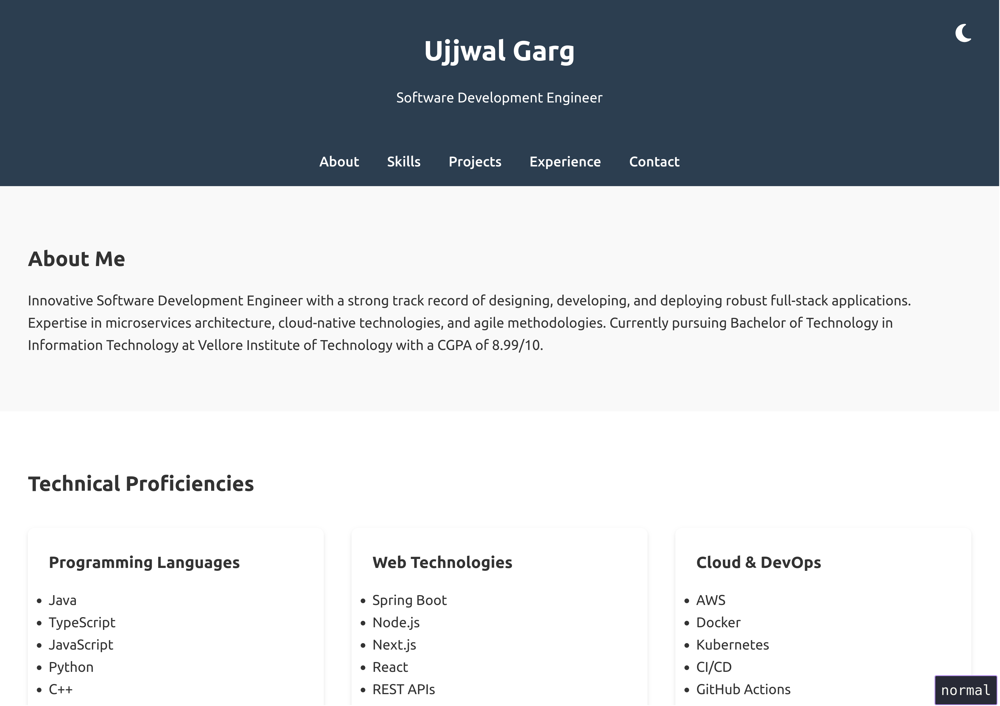
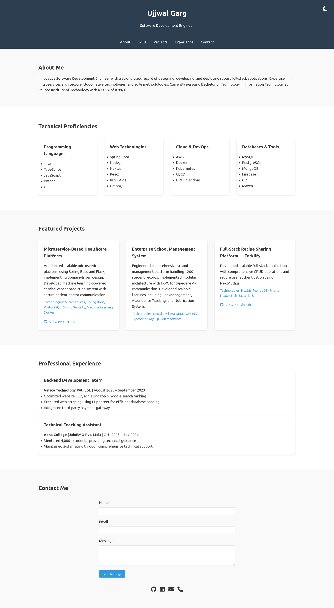
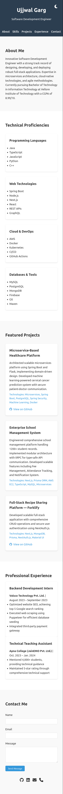

# Personal Portfolio Website Documentation

## Project Overview

A responsive personal portfolio website built using HTML, CSS, and JavaScript,
showcasing my professional background, projects, and technical skills. The
website serves as an interactive resume and demonstrates my web development
capabilities.

## Live Demo

- GitHub Repository: [https://github.com/ujjwalgarg100204/worldline-portfolio-assignment.git]
- Live Website: [https://ujjwalgarg100204.github.io/worldline-portfolio-assignment/]

## Table of Contents

1. [Step-by-Step Documentation](#step-by-step-documentation)
2. [Learning Reflections](#learning-reflections)
3. [Tools and Technologies](#tools-and-technologies)
4. [Project Structure](#project-structure)
5. [Design Choices](#design-choices)
6. [The Importance of a Personal Webpage](#the-importance-of-a-personal-webpage)
7. [Deployment Guide](#deployment-guide)

## Step-by-Step Documentation

### 1. Initial Setup and Planning

- Created project structure and initialized Git repository
- Planned website sections: About, Skills, Projects, Experience, and Contact
- Designed mobile-first responsive layout
- Set up development environment with `neovim`

### 2. HTML Structure Development

- Created semantic HTML structure for better accessibility
- Implemented navigation menu with smooth scrolling
- Organized content sections logically
- Added Font Awesome icons for visual elements

### 3. Styling Implementation

- Developed responsive CSS using custom variables
- Implemented dark/light theme functionality
- Created grid-based layouts for skills and projects
- Added hover effects and transitions for interactivity
- Ensured cross-browser compatibility

### 4. JavaScript Functionality

- Implemented theme switcher with local storage
- Added smooth scrolling navigation
- Ensured responsive behavior across devices
- Implemented interactive elements

### 5. Content Integration

- Added personal information and professional summary
- Integrated project showcases with descriptions
- Listed technical skills and proficiencies
- Added professional experience details
- Created contact section with direct links

### 6. Testing and Optimization

- Tested responsiveness across different devices
- Validated HTML and CSS
- Optimized performance
- Checked cross-browser compatibility
- Validated all links and interactions

## Tools and Technologies Used

- **HTML5**: Semantic structure and content organization
- **CSS3**: Styling, animations, and responsiveness
- **JavaScript**: Interactive features and theme switching
- **Font Awesome**: Icons and visual elements
- **Git**: Version control
- **GitHub Pages**: Deployment platform
- **neovim**: Development environment

## Project Structure

```bash
portfolio/
│
├── index.html          # Main HTML file
├── README.md          # Project documentation
└── screenshots/       # Website screenshots
    ├── desktop.png
    ├── mobile.png
    └── demo.png
```

## Design Choices



### Color Scheme

- Light theme: Clean, professional colors
- Dark theme: Comfortable dark mode for better readability
- Accent colors for highlighting important elements

### Typography

- System fonts for optimal performance
- Hierarchical text structure for better readability
- Responsive font sizes

### Layout

- Mobile-first responsive design
- Grid-based layout for skills and projects
- Flexible containers for content sections

## Learning Reflections

1. **Responsive Design Mastery**

   - Learned to create truly responsive layouts using CSS Grid and Flexbox
   - Understood the importance of mobile-first design approach

2. **Theme Implementation**

   - Mastered CSS variables for dynamic theming
   - Implemented persistent theme storage using localStorage

3. **Performance Optimization**

   - Minimized external dependencies
   - Optimized asset loading and performance

4. **Version Control**

   - Improved Git workflow knowledge
   - Learned proper commit message practices

5. **CSS Best Practices**

   - Implemented BEM methodology for CSS organization
   - Created reusable component styles

6. **JavaScript Functionality**

   - Enhanced understanding of DOM manipulation
   - Implemented smooth scrolling and theme switching

7. **Accessibility**

   - Learned importance of semantic HTML
   - Implemented proper ARIA labels

8. **Cross-browser Compatibility**

   - Handled browser-specific issues
   - Ensured consistent behavior across platforms

9. **Documentation**

   - Developed clear documentation practices
   - Created comprehensive README

10. **Deployment**
    - Mastered GitHub Pages deployment process
    - Understood importance of proper build process

## The Importance of a Personal Webpage

### Professional Branding

- Serves as a digital portfolio showcasing skills and projects
- Demonstrates technical capabilities through implementation
- Creates a strong personal brand presence

### Career Opportunities

- Provides easy access for potential employers
- Showcases real-world project experience
- Demonstrates initiative and technical expertise

### Professional Development

- Acts as a continuous learning project
- Allows for regular updates and improvements
- Showcases growth over time

## Deployment Guide

1. **GitHub Pages Setup**

- Go to repository Settings
- Navigate to Pages section
- Select main branch as source
- Save changes

2. **Verify Deployment**

- Wait for GitHub Pages to build and deploy
- Check the provided URL
- Verify all features are working correctly

## Screenshots





## Future Improvements

- Add blog section
- Implement project filtering
- Add more interactive elements
- Integrate with a CMS for easier updates
- Add project demo videos

---

© 2024 Ujjwal Garg. All Rights Reserved.
